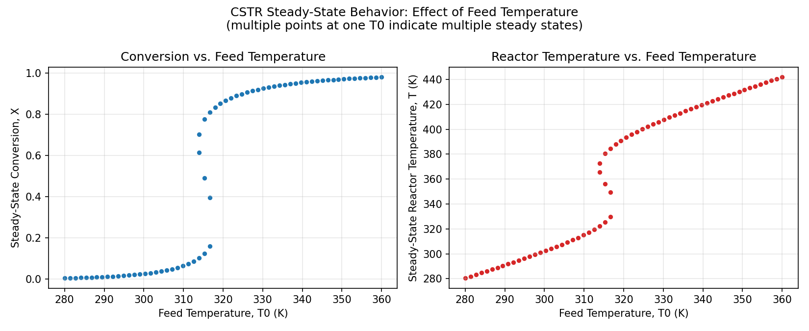
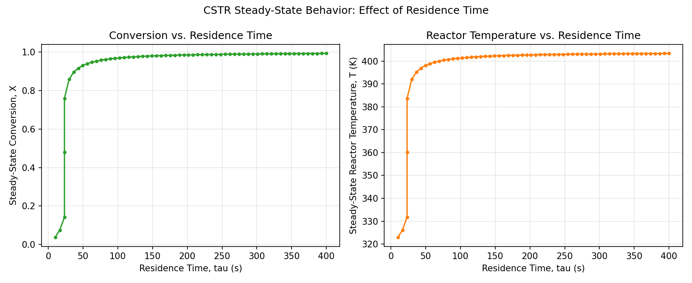
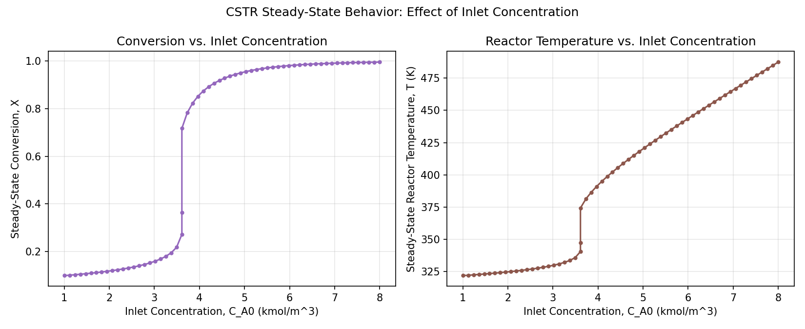

# Steady-State CSTR Reactor Simulator

A Python script that models the steady-state behavior of a non-isothermal
Continuous Stirred Tank Reactor (CSTR) running a simple, hypothetical
first-order, exothermic, liquid-phase reaction:

```
A  --k-->  B
```

## What it does

- Solves the coupled steady-state **mass balance** and **energy balance**
  for the reactor using Arrhenius kinetics (`scipy.optimize.fsolve`).
- Scans multiple initial guesses to detect **multiple steady states**
  (ignition/extinction behavior) — a classic phenomenon in non-isothermal
  CSTR design.
- Sweeps key operating parameters — feed temperature, residence time,
  and inlet concentration — and plots their effect on conversion and
  reactor temperature.
- With the default parameters, the feed-temperature sweep reproduces a
  textbook ignition curve: conversion jumps from ~10% to ~85%+ over a
  narrow temperature window (~314–318 K), with three coexisting steady
  states in between.

## Theory / Equations

This follows standard steady-state CSTR design equations from chemical
reaction engineering texts (e.g. Fogler, *Elements of Chemical Reaction
Engineering*, Chs. 6, 8/12) and standard non-isothermal CSTR
multiple-steady-state treatments (LearnChemE modules, UCSB/WashU
reactor-design course notes).

**1. Reaction kinetics (Arrhenius law)**

```
k(T) = k0 * exp(-Ea / (R * T))
```

**2. Rate law (first order in A)**

```
-r_A = k(T) * C_A
```

**3. Steady-state mass balance** (mole balance on species A)

```
F_A0 - F_A - (-r_A) * V = 0
```

Dividing through by volumetric flow rate `Q0`, defining residence time
`tau = V / Q0`, and writing concentrations in terms of conversion `X`
(`C_A = C_A0 * (1 - X)` for constant density/liquid phase):

```
X = (k(T) * tau) / (1 + k(T) * tau)        ... "M" line
```

This is the algebraic relationship between conversion `X` and reactor
temperature `T` for a given residence time.

**4. Steady-state energy balance** (no phase change, constant heat
capacities, single reaction)

```
Q0 * rho * Cp * (T0 - T) + (-Delta_H_rxn) * (-r_A) * V - U * A_ht * (T - Tc) = 0
```

Dividing by `Q0 * rho * Cp` and substituting `(-r_A)*V = F_A0 * X` gives
the energy-balance line relating `X` and `T`:

```
X = [rho*Cp*(T - T0) + (U*A_ht/Q0)*(T - Tc)] / (C_A0 * (-Delta_H_rxn))   ... "E" line
```

**5. Steady-state operating point(s)**

The reactor's steady-state operating point(s) are the intersection(s) of
the M line and the E line. Depending on parameters (especially
activation energy, heat of reaction, and cooling capacity), a
non-isothermal CSTR can have **one or as many as three** steady-state
solutions — the classic ignition/extinction multiplicity behavior.

The script solves the combined nonlinear system (mass balance + energy
balance, both functions of `T` and `X`) simultaneously with
`scipy.optimize.fsolve`, scanning multiple initial temperature guesses
to reveal multiple steady states where they exist.

## Units

All units are SI-derived "chemical engineering practical" units:

| Quantity        | Unit |
|---|---|
| Concentration   | kmol/m³ |
| Temperature     | K |
| Volume          | m³ |
| Volumetric flow | m³/s |
| Energy          | kJ |
| Heat capacity   | kJ/(kg·K) |
| Density         | kg/m³ |
| Heat of reaction| kJ/kmol (negative = exothermic) |
| Rate constant   | 1/s (k0, pre-exponential factor, first-order) |
| Activation energy | kJ/kmol (consistent with R = 8.314 kJ/(kmol·K)) |

## Requirements

```bash
pip install numpy scipy matplotlib
```

(Python 3.8+)

## Usage

```bash
python reaction_simulator.py
```

What happens:

1. The script prints the steady-state operating point(s) for the
   default "base case" conditions defined in the `BASE_CASE` dict.
2. It performs three parametric sweeps, each producing a plot:
   - Conversion & Temperature vs. **feed temperature** (T0)
   - Conversion & Temperature vs. **residence time** (tau)
   - Conversion & Temperature vs. **inlet concentration** (C_A0)
3. All three figures are displayed with matplotlib and also saved as
   PNG files in the working directory:
   - `conversion_vs_feed_temperature.png`
   - `conversion_vs_residence_time.png`
   - `conversion_vs_inlet_concentration.png`

## Example Output

Generated plots from a base-case run (saved in `/plots`):

**Conversion & Temperature vs. Feed Temperature**



**Conversion & Temperature vs. Residence Time**



**Conversion & Temperature vs. Inlet Concentration**



## Customizing

Edit the `BASE_CASE` dictionary near the top of the script to model
your own kinetics, thermodynamics, feed conditions, reactor geometry,
or heat transfer setup. Parameter sweep ranges can be adjusted inside
the `main()` function.
